# Ultimate Free AI Dev Stack — Elite Enterprise Installation Guide (v2025.06)

 
 


> 🚀 **Deploy a complete AI development environment in under 30 minutes**

Deploy a secure, offline-capable, and extensible AI development environment with **zero SaaS dependencies**. This guide enables IT teams and non-expert users to build, test, and operate modern AI workflows using only free, open-source tools. Now enhanced with observability and self-healing for true enterprise resilience.

## ✨ Key Features

- 🔒 **100% Offline Capable** - No external dependencies after setup
- 🛡️ **Enterprise Security** - Built-in firewall, intrusion prevention, and encrypted backups  
- 🤖 **Complete AI Stack** - Ollama (LLMs) + AnythingLLM (RAG) + Continue.dev (Copilot)
- 📊 **Observability** - Prometheus + Grafana dashboards with automated alerts
- 🔄 **Self-Healing** - Automatic service recovery and health monitoring
- 🐧 **WSL2 Optimized** - Seamless Windows integration

## 📋 Table of Contents
- [✨ Key Features](#-key-features)
- [🏗️ Architecture Overview](#️-architecture-overview)
- [🚀 Installation Steps](#-installation-steps)
- [✅ Validation and Maintenance](#-validation-and-maintenance)
- [🔧 Troubleshooting](#-troubleshooting)
- [❓ FAQ](#-faq)  
- [🤖 MCP/AI Agent Layer](#-mcpai-agent-layer--architecture-extensibility-and-workflow)
- [🔐 Security Reference](#-security-reference--best-practices--compliance)
- [📊 Observability & Self-Healing](#-observability--self-healing)
- [👥 Best Practices for Non-Expert Users](#-best-practices-for-non-expert-users)

---

## 🏗️ Architecture Overview

### Visual Diagram

```mermaid
graph TB
    subgraph "🖥️ Windows 11 Host (v23H2+)"
        WinHost["💻 User Desktop<br/>🌐 Browser<br/>🛡️ Firewall"]
    end
    
    subgraph "🐧 WSL2 Virtualization Layer"
        WSL["🔧 Ubuntu 22.04 LTS<br/>🔒 Isolated Environment"]
    end
    
    subgraph "⚙️ Core Infrastructure (WSL2)"
        Docker["🐳 Docker<br/>Compose"]
        NodeJS["🟢 Node.js<br/>(nvm, npm)"]
        Python["🐍 Python<br/>(venv)"]
        Fail2ban["🛡️ Fail2ban<br/>(Intrusion Prevention)"]
        UFW["🔥 UFW<br/>(Firewall)"]
    end
    
    subgraph "🤖 AI Agent/Dev Layer (MCP Framework)"
        Continue["🔄 Continue.dev<br/>(VS Code Copilot)"]
        AnythingLLM["🧠 AnythingLLM<br/>(Memory/RAG)"]
        Ollama["🦙 Ollama<br/>(LLMs: Mistral, Phi-2)"]
        MCP["🔗 MCP Layer<br/>Context/Agent Orchestration"]
    end
    
    subgraph "📊 Observability & Self-Healing Layer"
        Prometheus["📈 Prometheus<br/>(Collector)"]
        NodeExporter["📊 Node Exporter<br/>(Metrics)"]
        cAdvisor["📦 cAdvisor<br/>(Docker)"]
        Grafana["📋 Grafana<br/>(Dashboards, Alerts)"]
        Alertmanager["🚨 Alertmanager"]
    end
    
    subgraph "👥 End User / IT"
        EndUser["🖥️ Dashboards &<br/>📱 Notifications"]
    end
    
    WinHost --> WSL
    WSL --> Docker
    WSL --> NodeJS
    WSL --> Python
    WSL --> Fail2ban
    WSL --> UFW
    
    Docker --> Continue
    NodeJS --> AnythingLLM
    Python --> Ollama
    
    Continue <--> MCP
    AnythingLLM <--> MCP
    Ollama <--> MCP
    
    MCP --> Prometheus
    Prometheus <--> NodeExporter
    Prometheus <--> cAdvisor
    Prometheus --> Grafana
    Grafana --> Alertmanager
    
    Alertmanager --> EndUser
    Grafana --> EndUser
    
    classDef windowsStyle fill:#0078d4,stroke:#005a9e,stroke-width:3px,color:#fff
    classDef wslStyle fill:#e95420,stroke:#c7431b,stroke-width:3px,color:#fff
    classDef infraStyle fill:#28a745,stroke:#1e7e34,stroke-width:2px,color:#fff
    classDef aiStyle fill:#6f42c1,stroke:#533a95,stroke-width:3px,color:#fff
    classDef observeStyle fill:#fd7e14,stroke:#e8590c,stroke-width:2px,color:#fff
    classDef userStyle fill:#17a2b8,stroke:#117a8b,stroke-width:2px,color:#fff
    
    class WinHost windowsStyle
    class WSL wslStyle
    class Docker,NodeJS,Python,Fail2ban,UFW infraStyle
    class Continue,AnythingLLM,Ollama,MCP aiStyle
    class Prometheus,NodeExporter,cAdvisor,Grafana,Alertmanager observeStyle
    class EndUser userStyle
```



---

## 🚀 Installation Steps

### Step 1: Prepare Windows 11 Host

1. **Enable Virtualization in BIOS/UEFI:**
   - Restart PC, access BIOS (Del/F2/Esc at boot).
   - Enable “Virtualization Technology”/“Intel VT-x/AMD-V.”
   - Save and reboot.

2. **Install WSL2:**
   - Open PowerShell as Admin.
   - Run: `wsl --install Ubuntu-24.04`.

3. **Update Windows and WSL2:**
   - Run: `wsl --update`.

### Step 2: Set Up Ubuntu 22.04 in WSL2

1. Launch Ubuntu from the Start Menu.
2. Update the Linux system:
   ```bash
   sudo apt update && sudo apt upgrade -y
   ```
3. Set your username and password when prompted.

### Step 3: Install Core Development Tools

1. Install essential tools:
   ```bash
   sudo apt install -y build-essential curl git wget unzip python3-pip python3-venv
   python3 --version
   python3 -m venv .venv
   source .venv/bin/activate
   ```

2. Install Node.js (v20.x):
   ```bash
   curl -fsSL https://deb.nodesource.com/setup_20.x | sudo -E bash -
   sudo apt install -y nodejs
   node -v && npm -v
   ```

### Step 4: Install Docker & Docker Compose

1. Install Docker:
   ```bash
   sudo apt install docker.io docker-compose -y
   sudo usermod -aG docker $USER
   newgrp docker
   sudo systemctl enable docker
   sudo systemctl start docker
   docker --version
   docker-compose --version
   ```

### Step 5: Secure Your System

1. Install Firewall (UFW):
   ```bash
   sudo apt install ufw -y
   sudo ufw enable
   sudo ufw allow OpenSSH
   sudo ufw allow 3001   # AnythingLLM
   sudo ufw allow 11434  # Ollama
   sudo ufw allow 9000   # (If using SMB/9P file sharing)
   sudo ufw status
   ```

2. Install Fail2ban:
   ```bash
   sudo apt install fail2ban -y
   sudo systemctl enable fail2ban
   sudo systemctl start fail2ban
   sudo fail2ban-client status
   ```

### Step 6: Set Up GitHub SSH Access (Optional)

1. Generate SSH key:
   ```bash
   ssh-keygen -t ed25519 -C "your@email.com"
   eval "$(ssh-agent -s)"
   ssh-add ~/.ssh/id_ed25519
   cat ~/.ssh/id_ed25519.pub
   ```

2. Add your public key to GitHub:
   - Go to GitHub → Settings → SSH & GPG Keys → New SSH Key.

3. Test SSH connection:
   ```bash
   ssh -T git@github.com
   ```

### Step 7: Install AI Agents (MCP Layer)

#### a. Ollama (Local LLM Runner)

1. Install Ollama:
   ```bash
   curl -fsSL https://ollama.com/install.sh | sh
   ollama run mistral
   ```

2. Try other models (with system requirements):
   ```bash
   # Mistral 7B - Disk: 4.1GB | RAM: 8GB | CPU: 4+ cores | GPU: Optional (NVIDIA/AMD)
   ollama run mistral
   
   # Phi-3 Mini - Disk: 2.3GB | RAM: 4GB | CPU: 2+ cores | GPU: Optional
   ollama run phi
   
   # Mixtral 8x7B - Disk: 26GB | RAM: 48GB | CPU: 8+ cores | GPU: Recommended (16GB+ VRAM)
   ollama run mixtral
   ```

   > **Note**: GPU acceleration significantly improves performance. NVIDIA GPUs work out-of-the-box, AMD GPUs require ROCm setup.

#### b. AnythingLLM (Memory/RAG Agent)

This repository includes the AnythingLLM source code in the `anything-llm/` directory.

1. Navigate to the project root and run the setup script to install all dependencies:
   ```bash
   cd anything-llm
   yarn setup
   ```

2. Configure the server environment:
   ```bash
   cp server/.env.example server/.env
   nano server/.env  # Set STORAGE_DIR, HOST, PORT, and other values as needed
   ```

3. Configure the frontend environment:
   ```bash
   nano frontend/.env  # Set VITE_API_BASE='/api' for production
   ```

4. Build and start the services:
   ```bash
   # Build frontend
   cd frontend && yarn build
   
   # Copy frontend build to server
   cp -R frontend/dist server/public
   
   # Prepare database
   cd ../server && npx prisma generate --schema=./prisma/schema.prisma
   cd server && npx prisma migrate deploy --schema=./prisma/schema.prisma
   
   # Start server (port 3001 by default)
   NODE_ENV=production node index.js &
   
   # Start collector (in another terminal)
   cd ../collector && NODE_ENV=production node index.js &
   ```

   > **Note**: AnythingLLM will be available at `http://localhost:3001` (not 9898 as mentioned earlier)

#### c. Continue.dev (VS Code Copilot)

1. Open VS Code.
2. Install the [Continue - AI Assistant](https://marketplace.visualstudio.com/items?itemName=Continue.continue) extension from the VS Code Marketplace.
3. Start a new chat:
   - Press `Ctrl+Shift+P` → “Continue: Start New Chat.”

---

## ✅ Validation and Maintenance

### Step 8: Validate, Test, and Use

1. Check each service:
   - Docker: `docker ps`.
   - Ollama: `ollama list`, open [http://localhost:11434](http://localhost:11434).
   - AnythingLLM: open [http://localhost:3001](http://localhost:3001).
   - Continue.dev: open a chat in VS Code.

2. Review logs for errors and resolve using the troubleshooting guide.

### Step 9: Backup & Ongoing Maintenance

1. Automate encrypted backups:
   ```bash
   sudo apt install restic -y
   restic init -r /mnt/backup/llm-backups
   restic backup --repo /mnt/backup/llm-backups ~/projects/freedom-stack-ai
   ```

2. Schedule backups with cron for daily/weekly intervals.

3. Update regularly:
   - Ubuntu: `sudo apt update && sudo apt upgrade -y`.
   - Docker: `sudo apt install docker.io -y`.
   - VS Code, Node, Python, NPM: as per official docs.

---

## 🔧 Troubleshooting

| Issue                                 | Solution                                               |
| ------------------------------------- | ------------------------------------------------------ |
| WSL2 does not start                   | Update WSL2, reboot, check virtualization              |
| Docker "permission denied"            | `sudo usermod -aG docker $USER && newgrp docker`       |
| Ollama model won’t download           | Check internet, retry, check disk space                |
| AnythingLLM port error                | Verify port availability, adjust firewall              |
| Continue.dev not appearing in VS Code | Reinstall extension, restart VS Code, check agent logs |
| Fail2ban not starting                 | Check `/var/log/fail2ban.log` for errors               |
| Security update failures              | Run `sudo apt update && sudo apt upgrade`              |

---

## ❓ FAQ

1. **Can this stack run fully offline?**
   - Yes, after initial model/tool downloads.

2. **Can I use this for multiple users?**
   - Yes—enable RBAC and configure per-user project directories.

3. **How do I ensure backups are encrypted?**
   - Use tools like `restic` with password-protected repos.

4. **How do I expand the agent layer?**
   - Integrate new REST/CLI tools or VS Code extensions using the MCP integration model.

---

## 🤖 MCP/AI Agent Layer — Architecture, Extensibility, and Workflow

### Overview

The Multi-Context Protocol (MCP) orchestrates agent interactions, automating secure data flows and context exchange across Continue.dev, Ollama, and AnythingLLM. This pattern is designed for extensibility, privacy, and enterprise readiness.

### MCP Layer Diagram

```mermaid
graph TD
    subgraph "👤 User Layer"
        User["🧑‍💻 Developer"]
    end
    
    subgraph "💻 Development Environment"
        VSCode["🆚 VS Code<br/>(Continue.dev)"]
    end
    
    subgraph "🧠 Knowledge & Memory"
        AnythingLLM["🧠 AnythingLLM<br/>📚 RAG Engine<br/>💾 Memory Store"]
    end
    
    subgraph "🤖 AI Models"
        Ollama["🦙 Ollama<br/>🤖 Local LLMs<br/>⚡ Inference Engine"]
    end
    
    subgraph "🔗 MCP Orchestration Layer"
        MCP["🎛️ Multi-Context Protocol<br/>🔄 Agent Coordination<br/>🛡️ Secure Data Flow<br/>📡 API Gateway"]
    end
    
    subgraph "📊 Output & Actions"
        Output["📝 Secure Output<br/>📋 Logs & Actions<br/>🔐 Audit Trail"]
    end
    
    User --> VSCode
    VSCode <--> AnythingLLM
    VSCode --> MCP
    AnythingLLM --> MCP
    MCP <--> Ollama
    MCP --> Output
    Output --> User
    
    classDef userStyle fill:#20c997,stroke:#17a085,stroke-width:3px,color:#fff
    classDef devStyle fill:#0d6efd,stroke:#0a58ca,stroke-width:3px,color:#fff
    classDef knowledgeStyle fill:#6f42c1,stroke:#533a95,stroke-width:3px,color:#fff
    classDef aiStyle fill:#fd7e14,stroke:#e8590c,stroke-width:3px,color:#fff
    classDef mcpStyle fill:#dc3545,stroke:#b02a37,stroke-width:4px,color:#fff
    classDef outputStyle fill:#198754,stroke:#146c43,stroke-width:3px,color:#fff
    
    class User userStyle
    class VSCode devStyle
    class AnythingLLM knowledgeStyle
    class Ollama aiStyle
    class MCP mcpStyle
    class Output outputStyle
```



---

## 🔐 Security Reference — Best Practices & Compliance

1. Patch OS/Docker/agent dependencies regularly; automate checks.
2. Run agents under dedicated Unix users, restrict `.env`/keys.
3. Use encrypted backups (restic/duplicity), schedule cron jobs.
4. Firewall: open only agent/SSH ports; block outbound where possible.
5. Retain and review agent logs for audits; map controls to CIS/NIST/ISO.

---

## 📊 Observability & Self-Healing

### Purpose & Business Value

Observability and self-healing ensure your stack is “always-on,” self-monitoring, and easy to manage—even for non-expert users:

1. Instantly see if anything is wrong—before it impacts your work.
2. Get automatic notifications (email, Slack) if agents/services fail or resources spike.
3. Services restart automatically, minimizing downtime and manual troubleshooting.
4. All performance data is stored and visualized for proactive support and compliance.

### System Diagram

```mermaid
graph TB
    subgraph "🤖 AI Development Stack"
        subgraph "🦙 Ollama Services"
            OllamaAPI["🌐 Ollama API<br/>Port: 11434"]
            OllamaModels["🧠 LLM Models<br/>Mistral • Phi • Mixtral"]
        end
        
        subgraph "🧠 AnythingLLM Services"
            AnythingAPI["🌐 AnythingLLM API<br/>Port: 3001"]
            AnythingRAG["📚 RAG Engine<br/>Vector Database"]
        end
        
        subgraph "🆚 Continue.dev"
            ContinueExt["🔌 VS Code Extension<br/>AI Assistant"]
        end
    end
    
    subgraph "📊 Monitoring & Metrics"
        subgraph "📈 Exporters"
            NodeExp["📊 Node Exporter<br/>🖥️ System Metrics<br/>Port: 9100"]
            cAdvisor["📦 cAdvisor<br/>🐳 Container Metrics<br/>Port: 8080"]
        end
        
        subgraph "🔍 Collection"
            Prometheus["📈 Prometheus<br/>⚡ Metrics Collector<br/>Port: 9090"]
        end
        
        subgraph "📋 Visualization"
            Grafana["📊 Grafana<br/>📈 Dashboard UI<br/>Port: 3000"]
        end
        
        subgraph "🚨 Alerting"
            Alertmanager["🚨 Alertmanager<br/>📧 Notifications<br/>Port: 9093"]
        end
    end
    
    subgraph "👨‍💼 Operations Team"
        Alerts["📱 Email/Slack Alerts<br/>🔔 Real-time Notifications"]
        Dashboards["🖥️ Monitoring Dashboards<br/>📊 Performance Metrics"]
    end
    
    %% Data Flow Connections
    OllamaAPI --> NodeExp
    AnythingAPI --> NodeExp
    ContinueExt --> NodeExp
    
    NodeExp --> Prometheus
    cAdvisor --> Prometheus
    
    Prometheus --> Grafana
    Prometheus --> Alertmanager
    
    Grafana --> Dashboards
    Alertmanager --> Alerts
    
    %% Service Interactions
    ContinueExt <--> OllamaAPI
    ContinueExt <--> AnythingAPI
    AnythingAPI <--> OllamaAPI
    
    classDef aiStyle fill:#6f42c1,stroke:#533a95,stroke-width:3px,color:#fff
    classDef monitorStyle fill:#fd7e14,stroke:#e8590c,stroke-width:2px,color:#fff
    classDef alertStyle fill:#dc3545,stroke:#b02a37,stroke-width:3px,color:#fff
    classDef userStyle fill:#198754,stroke:#146c43,stroke-width:2px,color:#fff
    classDef dataStyle fill:#0dcaf0,stroke:#0aa2c0,stroke-width:2px,color:#000
    
    class OllamaAPI,OllamaModels,AnythingAPI,AnythingRAG,ContinueExt aiStyle
    class NodeExp,cAdvisor,Prometheus,Grafana monitorStyle
    class Alertmanager alertStyle
    class Alerts,Dashboards userStyle
```



---

### Step-by-Step Guide

#### 1. Install Prometheus (Metrics Collector)

```bash
sudo apt update && sudo apt install prometheus -y
```

#### 2. Install Node Exporter (System Health)

```bash
sudo apt install prometheus-node-exporter -y
sudo systemctl enable prometheus-node-exporter
sudo systemctl start prometheus-node-exporter
```

#### 3. (Optional) Monitor Docker Containers

```bash
docker run -d \
  --name=cadvisor \
  --volume=/:/rootfs:ro \
  --volume=/var/run:/var/run:rw \
  --volume=/sys:/sys:ro \
  --volume=/var/lib/docker/:/var/lib/docker:ro \
  --publish=8080:8080 \
  gcr.io/cadvisor/cadvisor:latest
```

#### 4. Install Grafana (Visualization Dashboard)

```bash
sudo apt install -y apt-transport-https software-properties-common
sudo add-apt-repository "deb https://packages.grafana.com/oss/deb stable main"
wget -q -O - https://packages.grafana.com/gpg.key | sudo apt-key add -
sudo apt update
sudo apt install grafana -y
sudo systemctl enable grafana-server
sudo systemctl start grafana-server
```

- **Access Grafana:** [http://localhost:3000](http://localhost:3000) (default login: admin / admin).

#### 5. Connect Prometheus to Grafana

1. In Grafana, add Prometheus as a data source (default URL: `http://localhost:9090`).
2. Import dashboards from Grafana.com or create panels for CPU, memory, disk, and container health.

#### 6. Enable Automated Alerts

1. Install Alertmanager:
   ```bash
   sudo apt install prometheus-alertmanager -y
   sudo systemctl enable alertmanager
   sudo systemctl start alertmanager
   ```

2. Sample alert rule (Edit `/etc/prometheus/alert.rules`):
   ```yaml
   groups:
   - name: agent-alerts
     rules:
     - alert: HighCPUUsage
       expr: 100 * (1 - avg by(instance)(irate(node_cpu_seconds_total{mode="idle"}[5m]))) > 90
       for: 5m
       labels:
         severity: warning
       annotations:
         summary: "High CPU Usage (>90%)"
         description: "CPU usage above 90% for 5 minutes."
     - alert: AgentDown
       expr: up{job="ollama"} == 0
       for: 1m
       labels:
         severity: critical
       annotations:
         summary: "Ollama agent is down"
         description: "Ollama agent not responding."
   ```

3. Restart Prometheus:
   ```bash
   sudo systemctl restart prometheus
   ```

#### 7. Self-Healing — Auto-Restart on Failure

1. **systemd services:** Ensure each agent and exporter uses `Restart=always` in its systemd unit file:
   ```ini
   [Service]
   ExecStart=/usr/local/bin/ollama run mistral
   Restart=always
   RestartSec=5
   ```

2. **Docker containers:** Always use `--restart=always` with `docker run` or in `docker-compose.yml`.

---

## 👥 Best Practices for Non-Expert Users

1. **Check Grafana regularly** to see health dashboards (browser, user-friendly).
2. **Respond to alerts** sent by email or Slack.
3. **Most problems heal automatically**—if a service crashes, it restarts on its own.
4. **If issues repeat**, contact your technical lead with screenshots/logs.
5. **Back up configs** for Prometheus and Grafana periodically.

---

## 🤝 Contributing

We welcome contributions! Here's how you can help:

- 🐛 **Report Issues**: Open an issue for bugs or feature requests
- 📖 **Improve Documentation**: Help make the guide clearer
- 🔧 **Submit PRs**: Fix bugs or add new features
- 💬 **Share Feedback**: Let us know how we can improve

## 📝 License

This project is licensed under the MIT License - see the [LICENSE](LICENSE) file for details.

## 🙏 Acknowledgments

- [Ollama](https://ollama.com/) - Local LLM runtime
- [AnythingLLM](https://github.com/Mintplex-Labs/anything-llm) - RAG and memory management
- [Continue.dev](https://continue.dev/) - AI code assistant
- [Prometheus](https://prometheus.io/) & [Grafana](https://grafana.com/) - Observability stack

---

<div align="center">
  <strong>⭐ Star this repo if it helped you build your AI development stack!</strong>
</div>

